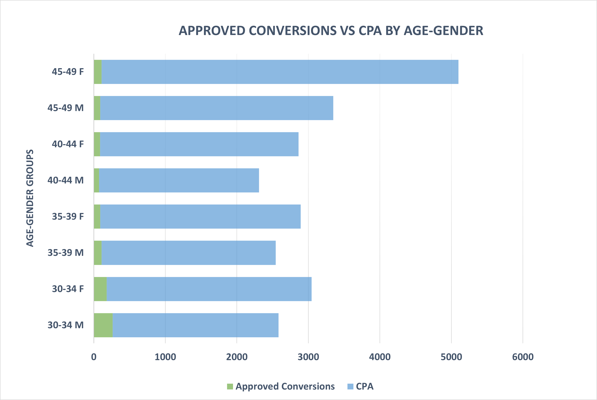
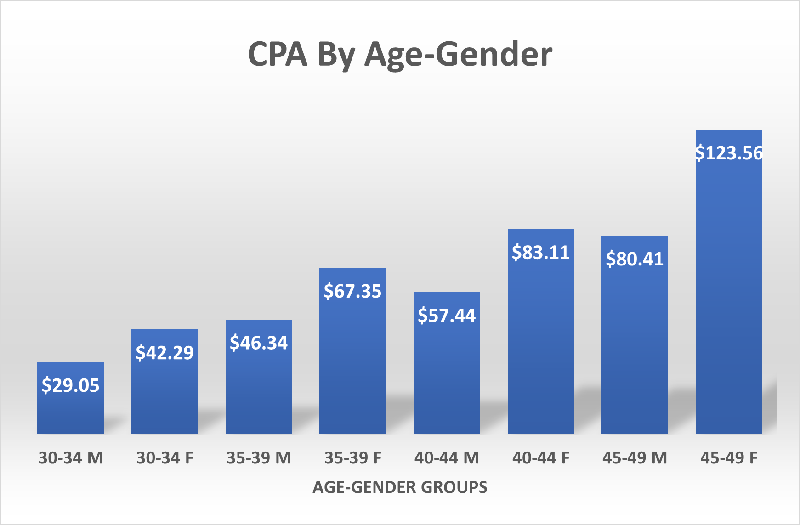
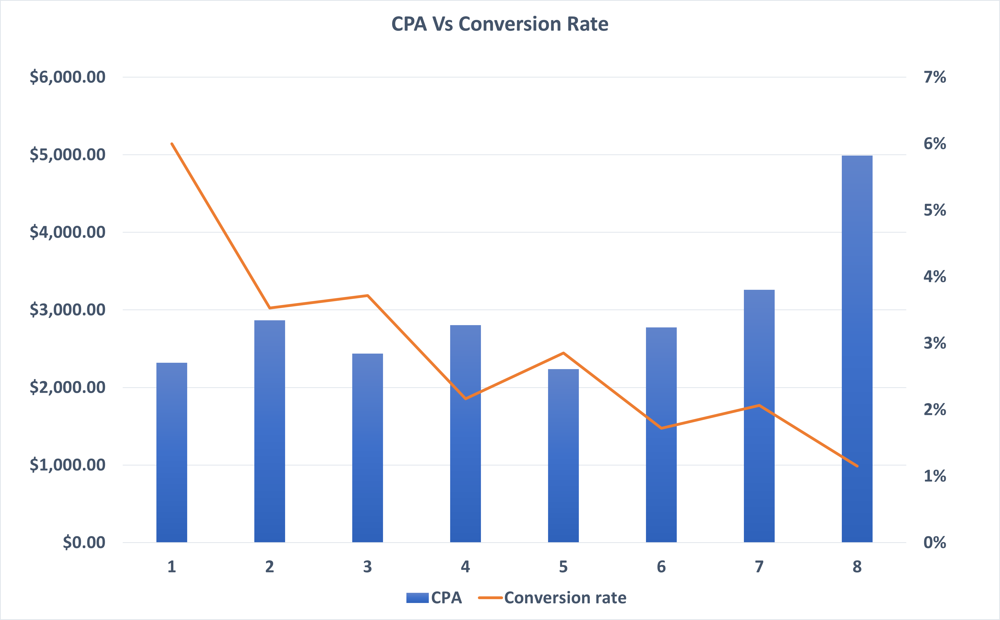
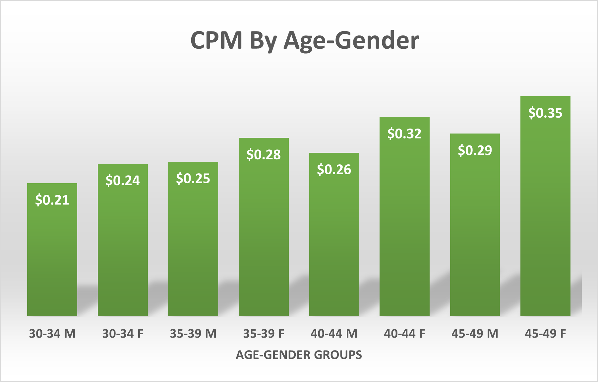
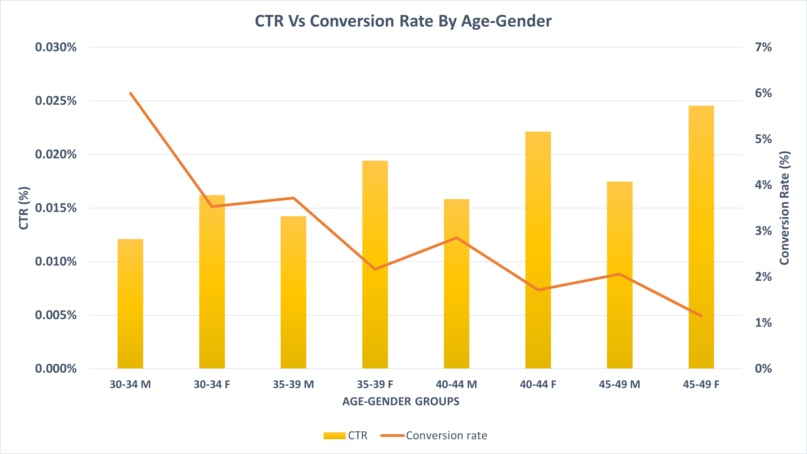

# Optimizing-Social-Media-Ad-Campaign-Performance-for-Audience-Engagement-and-ROI-Data-Analytics-

Business Context
TrendWave has run paid campaigns across Facebook, Instagram, Twitter, and LinkedIn for three months.
Data includes daily impressions, clicks, conversions, ad spend, and demographic breakdowns.
Despite substantial investment, there is no clarity on which platforms, creatives, and audience segments deliver the best value.
With quarterly targets approaching, the company requires an analytical framework to:
• Allocate ad budgets across platforms for optimal CPA
• Compare performance across audience demographics and segments
• Identify underperforming campaigns for reallocation or optimization
• Detect time-based performance trends and seasonality
• Provide evidence-backed recommendations for the next product launch

Problem Statement
Primary Challenge: Lack of a performance analysis framework to evaluate social media channels, quantify the impact of ad spend on conversions, and optimize targeting strategies.
This results in suboptimal ROI and missed growth opportunities.

Key Questions to Address
Which age and gender groups are responsible for the highest sales and ad spend, and how does their conversion efficiency compare?
How effective is the campaign in converting impressions into clicks and clicks into sales (CTR and Conversion Rate)?
Are there significant differences in CPA and CPM between demographic segments, and what does this imply for budget optimization?

KPIs Generated
• CPM (Cost per Mille): Cost of 1,000 impressions
• CPC (Cost per Click): Cost of each click
• CTR (Click-Through Rate): Percentage of impressions converted into clicks
• CPA (Cost per Acquisition): Cost of acquiring a new customer

About the Dataset
Name: Optimizing Social Media Ad Campaign Performance for Audience Engagement and ROI
Variables:
• ad_id – Unique ID for each ad
• xyzcampaignid – Campaign ID for XYZ company
• fbcampaignid – Facebook campaign tracking ID
• age – Age group of the person shown the ad
• gender – Gender of the person shown the ad
• interest – Interest category code (from Facebook profile)
• impressions – Number of times the ad was shown
• clicks – Number of ad clicks
• spent – Amount spent on the ad
• total_conversion – Number of people who enquired about the product
• approved_conversion – Number of people who bought the product

Tools and Technologies
• Excel
• PowerPoint
• PDF

Dataset
Raw data → uploaded in data/raw_dataset.xlsx
Cleaned data → uploaded in data/cleaned_dataset.xlsx

Analysis / Key Insights
1. CTR vs Conversion Rate:
• 45–49 F had highest CTR (0.025%) but lowest conversion rate (1%)
• 30–34 M had balanced CTR and highest conversion rate (6%)
2. CPA Comparison:
• Lowest CPA: 30–34 M ($29.05)
• Highest CPA: 45–49 F ($123.56)
3. CPM Comparison:
• Lowest CPM: 30–34 M ($0.21)
• Highest CPM: 45–49 F ($0.35)
• CPA vs CPM Scatter Plot:
• Clear cost-efficiency clusters
• Younger male segments outperform older female groups

## Charts / Screenshots
### Approved Conversions vs CPA by Age-Gender

### CPA by Age-Gender

### CPA vs Conversion Rate

### CPM by Age-Gender

### CTR vs Conversion Rate by Age-Gender

Added all chart screenshots

Reports / Presentations
PDF → docs/project.pdf

Folder Structure
data/ → raw and cleaned datasets
charts/ → PNG charts
docs/ → PDF report 

Author
Geetha Masipogu
GitHub: https://github.com/geetham2880
